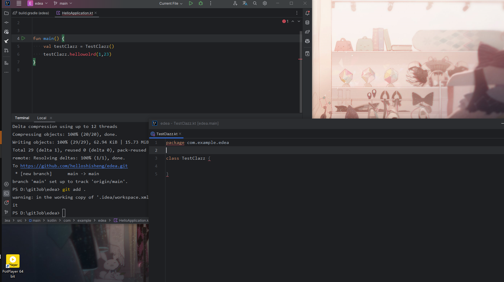

for https://youtrack.jetbrains.com/issue/IDEA-336873/When-using-Create-member-function-TestClazz.helloworld-an-error-occurs-if-two-windows-are-used-to-open-two-classes
minimum sample project

step:

1. open HelloApplication on windows1
2. open TestClazz on windows2
3. use "Create member function" to create a function in TestClazz
4. an error occurs

p.s. step 1,2 then like 

if you open like this  , it will not occur